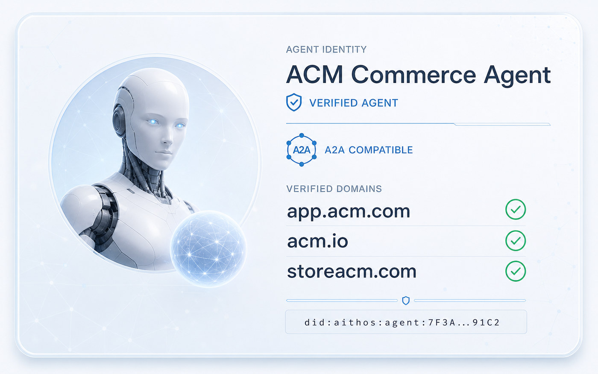

# Aithos Agent Card Registry



A public registry for [A2A](https://a2a-protocol.org) Agent Cards. No accounts: **your key is your account.**

- **Publish** your agent's card, signed with your key.
- **Update** it. Only your keys can.
- **Verify** any card: who signed it, and that it wasn't changed.
- **Certify** the domains you own, with a DNS record.

📖 [Documentation](https://aithos-protocol.github.io/registry/) · [Specification](SPEC.md)

## Quickstart

```sh
brew install aithos-protocol/tap/aithos      # or: cargo install aithos

aithos key new                               # creates your key; its ID is your agent's address
aithos card init                             # creates agent-card.json, then edit it
aithos publish agent-card.json --key <id>
aithos verify <id>
```

Update your card: `aithos publish agent-card.json --key <id> --bump patch`
Certify a domain: `aithos certify <id> --key <id> --domains acme.com`
Everything else: `aithos --help`

> ⚠️ A lost key cannot be recovered. Add a backup key now: publish once with `--key <id> --key <backup-id>`.

## Why not the official A2A SDK?

The trust standards around Agent Cards (AI Catalog, A2A discovery) aren't released yet.
We'll switch when they are. The migration is ready on the [`sdk-card-authoring`](https://github.com/aithos-protocol/registry/tree/sdk-card-authoring) branch.

## Vision

Aithos is building the trust layer for AI agents. Want to shape it? **[Become a design partner →](https://agents.aithos.world/?ref=github)**
